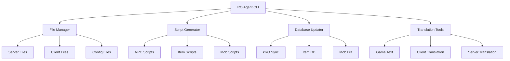

# 🗡️ Ragnarok Online Server Management Agent

**AI-Powered Tool for Managing Ragnarok Online Private Servers**

*Intelligent assistant for rAthena, Hercules, and other RO emulators - Script generation, item updates, translation, and server management*

[]()
[]()
[]()

---

## 📋 **Table of Contents**

- [**Features**](#-features)
- [**Supported Emulators**](#-supported-emulators)
- [**Quick Start**](#-quick-start)
- [**Architecture**](#-architecture)
- [**Usage Examples**](#-usage-examples)
- [**Contributing**](#-contributing)

---

## 🎯 **Features**

### **🔧 Core Management Tools**
- **Script Generation**: Automated NPC, item, and mob script creation
- **File Management**: Organize and manage server/client files efficiently
- **Database Updates**: Sync with kRO (Korean Ragnarok Online) databases
- **Translation Tools**: Handle game text and client file translations
- **Knowledge Base**: Comprehensive guides and best practices

### **🤖 AI-Powered Assistance**
- **Intelligent Caching**: Learn from your server configurations
- **Error Prevention**: Avoid common server setup mistakes
- **Pattern Recognition**: Adapt solutions to your specific setup
- **Context Awareness**: Understand your server structure and needs

### **🔄 Multi-Emulator Support**
- **rAthena**: Full support for the most popular emulator
- **Hercules**: Complete compatibility with Hercules server
- **OpenKore**: Bot framework integration
- **eAthena**: Legacy emulator support
- **Custom**: Extensible for other RO server implementations

---

## 🏰 **Supported Emulators**

| Emulator | Status | Features |
|----------|--------|----------|
| **rAthena** | ✅ Full Support | Complete script generation, database sync, translation |
| **Hercules** | ✅ Full Support | All management tools, file organization |
| **OpenKore** | 🚧 Partial | Bot configuration, basic management |
| **eAthena** | 🚧 Partial | Legacy support, migration tools |
| **Custom RO** | ✅ Extensible | Plugin system for new emulators |

---

## 🚀 **Quick Start**

```bash
# 1. Copy to your RO server directory
cp -r "Ragnarok Online Agent/" /path/to/your/ro/server/
cd /path/to/your/ro/server/

# 2. Auto-setup (detects your emulator automatically)
./Ragnarok\ Online\ Agent/.auto-setup          # Linux/Mac
./Ragnarok\ Online\ Agent/.auto-setup.bat      # Windows

# 3. Start managing your server
python "Ragnarok Online Agent/src/cli.py" --help
```

### Windows / PowerShell Notes
- Prefer `rg` for search; fallback: `Select-String -SimpleMatch -CaseSensitive:$false`.
- Quote paths with spaces using `-LiteralPath`, e.g., `-LiteralPath 'Ragnarok Online Agent\RAGNAROK_TEMPLATE.md'`.
- Read files in ≤ 250-line chunks: `Get-Content -TotalCount 250`.
- Timestamp helper for commit messages: `& '.\\Ragnarok Online Agent\\scripts\\timestamp.ps1'`.

---

## 🧠 Shared Context & Indexing

- Per-project state lives in `WORKSPACE_STATE/context.json` (auto-created by setup). It helps the agent remember instructions, detected emulator, backups, and tutorial progress locally without mixing with other projects.
- Optional: index your codebase/server to speed up mapping/catch-up:
  - `python scripts/indexer.py` → writes `WORKSPACE_STATE/code_index.json`
- Manage context quickly:
  - See progress: `python scripts/context-cli.py get progress.ro_agent`
  - Inspect state: `python scripts/context-cli.py dump`

---

## 🔧 Tools & Scripts

- `Ragnarok Online Agent/scripts/context-cli.py`: Manage shared `WORKSPACE_STATE/context.json` (get/set/append/log/dump)
- `Ragnarok Online Agent/scripts/context.sh` / `Ragnarok Online Agent/scripts/context.ps1`: Shell wrappers
- `Ragnarok Online Agent/scripts/indexer.py`: Create `WORKSPACE_STATE/code_index.json` to speed up server/code mapping

Convenience wrappers:
- Cross-platform search: `& '.\\Ragnarok Online Agent\\scripts\\search.ps1' -Pattern 'npc'` (PowerShell) or `./Ragnarok\ Online\ Agent/scripts/search.sh npc` (bash)
- Commit timestamp: `& '.\\Ragnarok Online Agent\\scripts\\timestamp.ps1'`

Cache helpers:
- Initialize cache from templates: `& '.\\Ragnarok Online Agent\\scripts\\cache-init.ps1'` or `./Ragnarok\ Online\ Agent/scripts/cache-init.sh`
- Validate cache JSON: `& '.\\Ragnarok Online Agent\\scripts\\validate-json.ps1'` or `./Ragnarok\ Online\ Agent/scripts/validate-json.sh`

Interoperability: shares `WORKSPACE_STATE/context.json` with other tools if used together in the same project.

Run these from your project root so the context is stored at `./WORKSPACE_STATE/` (invoke via full path as shown).

---

## 🏗️ **Architecture**



---

## 📖 **Usage Examples**

### **Generate NPC Scripts**
```bash
# Create a basic shop NPC
ro_agent script npc --type shop --name "Tool Dealer" --items 501,502,503

# Generate quest NPC with dialogue
ro_agent script npc --type quest --name "Quest Master" --dialog "Welcome adventurer!"
```

### **Update Item Database**
```bash
# Sync with latest kRO items
ro_agent update items --source kro --version latest

# Update specific item range
ro_agent update items --range 500-1000 --backup
```

### **Manage Server Files**
```bash
# Organize server files by type
ro_agent files organize --type scripts --destination npc/

# Backup critical configurations
ro_agent files backup --configs --database
```

### **Translation Tools**
```bash
# Translate item descriptions
ro_agent translate items --from english --to thai --file item_db.txt

# Translate client files
ro_agent translate client --files msgstringtable.txt --language spanish
```

---

## 🛠️ **Technical Details**

### **Requirements**
- Python 3.8+
- RO Server (rAthena/Hercules/OpenKore)
- Internet connection for kRO updates

### **Dependencies**
- click (CLI framework)
- requests (HTTP client)
- sqlite3 (local caching)
- pyyaml (configuration)
- beautifulsoup4 (web scraping)

### **File Structure**
```
Ragnarok Online Agent/
├── src/
│   ├── cli.py                 # Main CLI interface
│   ├── file_manager.py        # File organization tools
│   ├── script_generator.py    # Script creation engine
│   ├── database_updater.py    # kRO sync functionality
│   ├── translation_tools.py   # Translation utilities
│   └── knowledge_base.py      # Help and documentation
├── ANALYSIS_CACHE/
│   ├── errors/               # Error patterns and solutions
│   ├── patterns/             # Learned server configurations
│   └── scripts/              # Generated script cache
├── docs/
│   ├── setup_guide.md
│   ├── emulator_guide.md
│   └── troubleshooting.md
└── templates/
    ├── npc_template.txt
    ├── item_template.txt
    └── config_template.yml
```

---

## 🤝 **Contributing**

This tool grows with the RO community:

- **🐛 Bug Reports**: Found an issue with a specific emulator?
- **💡 Feature Requests**: Need support for a new RO feature?
- **📖 Documentation**: Help improve guides for other server admins
- **🔧 Code**: Contribute to the core functionality

---

## 📬 **Contact**

- **Creator:** Beeerrrr
- **Email:** beeerrrr@icloud.com
- **Project:** Personal study project for RO server management

---

**🎮 Level up your Ragnarok Online server management with AI-powered tools!**
